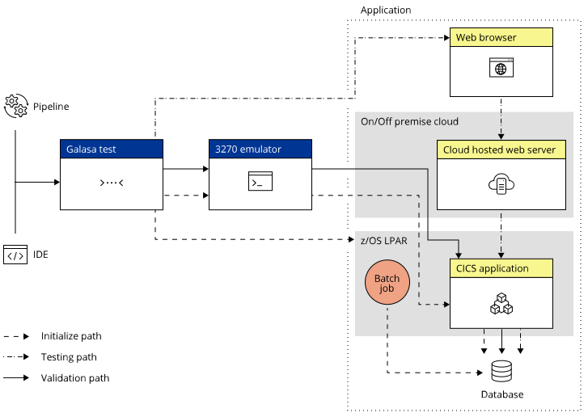

[Using Galasa in a Hybrid Cloud Environment](https://galasa.dev/about)

## Entry Level

### General Information
- Hybrid cloud environments mix different technologies for better efficiency, security, and performance.
- Testing everything together in these environments can be tricky.
- Galasa makes this testing easier with its comprehensive testing framework.
- It allows testing of applications on different platforms (like z/OS and Cloud) and with various technologies.
- Keeping all test results and details in one place makes it easier to create reports and figure out what went wrong.

### Components 

**Galasa Test**
- Galasa test is vital for checking everything works together in a hybrid cloud.
- You can start it from a coding tool or as part of an automated software release process.
- Galasa sets up the test environment, creates test data, runs the test, and checks the results.
- All test results and details are kept together for easy reporting and problem-solving.

**3270 Emulator**
- This is used to imitate interactions with mainframe computers in a hybrid cloud environment.

**Application**
- Represents the central part of the hybrid cloud application.
- Includes several important parts for thorough testing.

**Web Browser**
- Symbolizes the user interface and how users interact with the application.

**Database**
- Stores vital data for the hybrid cloud application.

**On/Off Premise Cloud**
- Indicates both internal and external cloud hosting options.

**Cloud Hosted Web Server**
- A web server that's run in the cloud.

**z/OS LPAR**
- Represents a mainframe computing environment.
- Includes components specific to mainframe technology.

**Batch Job**
- Signifies running batch processes on the mainframe.

**CICS Application**
- Related to mainframe applications under the Customer Information Control System (CICS).

## Specialist

### General Information
- Hybrid cloud environments combine different platforms and technologies for enhanced efficiency, security, and performance.
- End-to-end integration testing in such environments can be complex.
- Galasa simplifies this testing by providing a comprehensive testing framework.
- The framework enables the testing of applications running on diverse platforms (z/OS and Cloud) and utilizing various technologies.
- The centralized storage of test results and artifacts simplifies reporting and failure analysis.

### Components 

**Galasa Test**
- The Galasa test plays a crucial role in end-to-end integration testing in a hybrid cloud environment.
- It can be initiated from an IDE or as part of a CI/CD pipeline.
- Galasa initializes the test environment, generates test data, executes the test, and validates the test output.
- All test results and artifacts are centrally stored for easy report generation and failure diagnosis.

**3270 Emulator**
- The 3270 emulator is an essential component for simulating mainframe interactions in a hybrid cloud setup.

**Application**
- The "Application" nest represents the core of the hybrid cloud application.
- It contains several key components for end-to-end testing.

**Web Browser**
- The "Web browser" component represents the user interface and interactions with the application.

**Database**
- The database component stores critical data for the hybrid cloud application.

**On/Off Premise Cloud**
- The "On/Off premise cloud" nest indicates the dual nature of cloud hosting.

**Cloud Hosted Web Server**
- This component signifies a web server hosted in the cloud.

**z/OS LPAR**
- The "z/OS LPAR" nest represents a mainframe environment.
- It contains components related to mainframe technology.

**Batch Job**
- The "Batch job" component signifies the execution of batch processes on the mainframe.

**CICS Application**
- The "CICS application" component relates to Customer Information Control System (CICS) applications on the mainframe.
